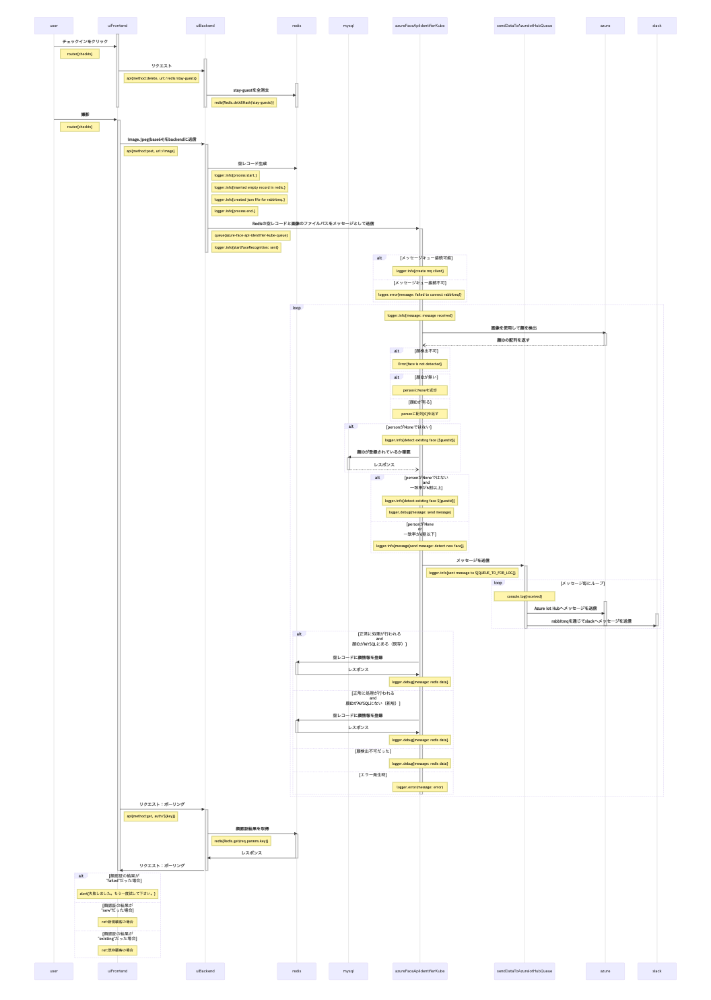

# omotebako-sequece  

omotenbako-sequence は、[omotebako-system](https://github.com/latonaio/omotebako-system)に含まれる機能のシーケンスを示したレポジトリです。  

## omotebako-system におけるチェックイン機能のシーケンス図  

以下の図は、omotebako-system における、チェックイン機能の一連のプログラム処理の流れと概要を示したシーケンス図です。  

  

