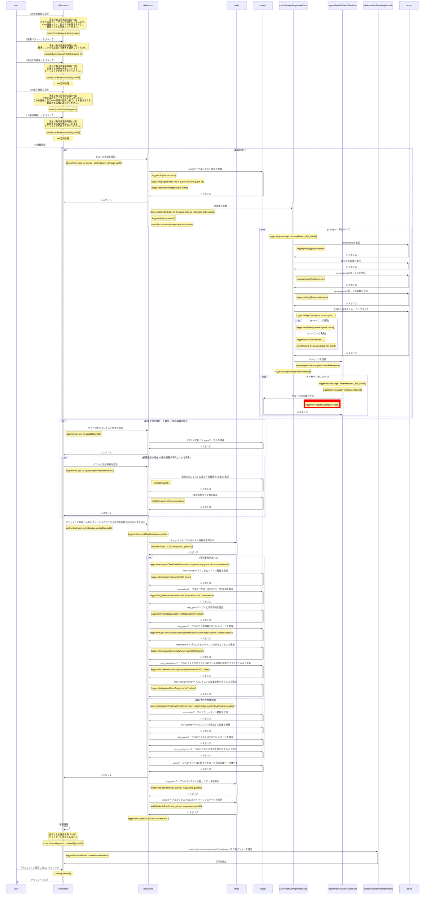

```mermaid

sequenceDiagram
# participant
participant user
participant uiFrontend
participant uiBackend
participant redis
participant mysql
participant azureFaceApiRegistratorKube
participant registerFaceToGuestTableKube
participant randomVoiceStreamingPeriodic
participant azure

# 新規顧客の場合
  user->>uiFrontend: ref:新規顧客の場合
  activate uiFrontend
    Note over uiFrontend:表示される画面の内容(一部)<br>お客さまのチェックイン登録を行っています。<br>Face情報がなく、初めてのお客さまです。<br>顧客リストと同期してください。
    Note over uiFrontend:router{/checkin/guest-list-message}
    user->>uiFrontend: 「顧客リストへ」をクリック
    Note over uiFrontend:表示される画面の内容(一部)<br>顧客リストから該当する顧客を選択してください。
    Note over uiFrontend:router{/checkin/guest/info/${list.guest_id}
    user->>uiFrontend: 「該当する顧客」をクリック
    Note over uiFrontend:表示される画面の内容(一部)<br>お客さま情報を表示しています、<br>チェックインを完了させてください。
    Note over uiFrontend:router{checkin/guest/info/{$guestid}}
    
    Note over uiFrontend:ref:登録処理
  deactivate uiFrontend

# 既存顧客の場合
  
  user->>uiFrontend: ref:既存顧客の場合
  activate uiFrontend
    Note over uiFrontend:表示される画面の内容(一部)<br>お客さまのチェックインを行っています。<br>このお客様は既にFace情報が登録されているお客さまです。<br>お客さま情報に進んでください。
    Note over uiFrontend:router{/checkin/existing-guest}
    user->>uiFrontend: 「お客様情報へ」をクリック
    Note over uiFrontend:表示される画面の内容(一部)<br>お客さま情報を表示しています、<br>チェックインを完了させてください。
    Note over uiFrontend:router{checkin/guest/info/{$guestid}}
    Note over uiFrontend:ref:登録処理
  deactivate uiFrontend

# チェックイン処理
  user->>uiFrontend: ref:登録処理
  activate uiFrontend
  alt 新規の場合
    activate uiBackend
      uiFrontend->>uiBackend: ゲストの情報を登録  
      Note right of uiFrontend:api{method: post, url:`guest/`, param:{guest_id,image_path}}

      uiBackend->>+mysql: guestテーブルにゲスト情報を登録
      Note right of uiBackend:logger.info{process start.}
      Note right of uiBackend:logger.info{register face info in guest ${content.guest_id}}
      Note right of uiBackend:logger.info{returned response to client.}
      mysql->>-uiBackend: レスポンス

      uiBackend->>uiFrontend: レスポンス  
    activate azureFaceApiRegistratorKube
      uiBackend->>azureFaceApiRegistratorKube: 顔画像を登録
      Note right of uiBackend:logger.info{created json file for azure-face-api-registrator-kube-queue.}
      Note right of uiBackend:logger.info{process end.}
      Note right of uiBackend:queue{azure-face-api-registrator-kube-queue}

    deactivate uiBackend

    loop メッセージ毎にループ
      Note over azureFaceApiRegistratorKube:logger.info{'message': 'received from: QUE_NAME}
        
      azureFaceApiRegistratorKube->>+azure: persongroupの取得
      Note right of  azureFaceApiRegistratorKube:logging.debug{get person list}
      azure->>-azureFaceApiRegistratorKube: レスポンス

      azureFaceApiRegistratorKube->>+azure: 顔の属性情報の取得
      azure->>-azureFaceApiRegistratorKube: レスポンス

      azureFaceApiRegistratorKube->>+azure: persongroupに新しく人を登録
      Note right of  azureFaceApiRegistratorKube:logging.debug{Create person}
      azure->>-azureFaceApiRegistratorKube: レスポンス

      azureFaceApiRegistratorKube->>+azure: persongroupに新しく顔画像を登録
      Note right of  azureFaceApiRegistratorKube:logging.debug{Set person image}
      azure->>-azureFaceApiRegistratorKube: レスポンス

      azureFaceApiRegistratorKube->>+azure: 登録した画像をトレーニングさせる
      Note right of  azureFaceApiRegistratorKube:logger.debug{Training the person group...}
      alt トレーニング成功
        Note right of  azureFaceApiRegistratorKube:logger.info(Training status ${train status}
      else トレーニング失敗
        Note right of  azureFaceApiRegistratorKube:logger.error('Failed to train ...'
        Note right of  azureFaceApiRegistratorKube:error{Training the person group has failed.}
      end
      azure->>-azureFaceApiRegistratorKube: レスポンス

      activate registerFaceToGuestTableKube
      azureFaceApiRegistratorKube->>registerFaceToGuestTableKube: メッセージを送信
      Note right of azureFaceApiRegistratorKube:queue{register-face-to-guest-table-kube-queue}
      Note over azureFaceApiRegistratorKube:logger.debug{message:send message}

      deactivate azureFaceApiRegistratorKube
      

        loop メッセージ毎にループ
          Note over registerFaceToGuestTableKube:logger.info{'message': 'received from: QUE_NAME}
          Note over registerFaceToGuestTableKube:logger.info{'message': 'message received'}
          registerFaceToGuestTableKube->>+mysql:ゲストの顔情報を登録
          rect rgb(255, 0, 0)
            Note left of registerFaceToGuestTableKube:logger.info{'updateGuest succeeded'}
          end
          mysql->>-registerFaceToGuestTableKube:レスポンス
        end
      deactivate registerFaceToGuestTableKube
    end
  end

  alt 新規登録が成功した場合 or 既存顧客の場合
    uiFrontend->>+uiBackend: ゲストIDをもとにゲスト情報を取得
    Note right of uiFrontend:api{method: get, url:guest/${guestId}}
    uiBackend->>+mysql: ゲストIDに紐づくguestテーブルを取得
    mysql->>-uiBackend: レスポンス
    uiBackend->>-uiFrontend: レスポンス


    alt 新規登録の場合 or 既存顧客が予約している場合
      uiFrontend->>+uiBackend: ゲストの部屋情報を登録  
      Note right of uiFrontend:api{method: get, url:`guest/${guestId}/reservations`}
      uiBackend->>+mysql: 選択されたゲストに紐づく部屋情報(複数)を取得
      Note right of uiBackend:sql{table:guest}
      mysql->>-uiBackend: レスポンス
      uiBackend->>+mysql: 部屋の割り当て数を取得
      Note right of uiBackend:sql{table:guest, leftjoin:reservation}
      mysql->>-uiBackend: レスポンス
      uiBackend->>-uiFrontend: レスポンス
    end

  end
  activate uiBackend
    uiFrontend->>uiBackend: チェックイン処理：redisにキャッシュされている宿泊客情報をMySQLに書き込む
    Note right of uiFrontend:api{method: post, url:redis/stay-guests/${guestId}}

    Note over uiBackend:logger.info(commitStayGuest process start.);
    uiBackend->>+redis: キャッシュされているゲスト情報を取得する
    Note right of uiBackend:redis{Redis.getJSON('stay-guests', guestID)}
    redis->>-uiBackend: レスポンス

    alt 事前予約があれば
      Note right of uiBackend:logger.Info('registerCheckinWithReservation registers stay-guest info from reservation.')
      uiBackend->>+mysql: transactionテーブルにチェックイン履歴を登録
      Note right of uiBackend:logger.Info('registerTransactionInTx clear.')
      mysql->>-uiBackend: レスポンス

      uiBackend->>+mysql: reservationテーブルからゲストIDに紐づく予約情報を取得
      Note right of uiBackend:logger.Info('getReservationInTx clear reservations: %s', reservations)
      mysql->>-uiBackend: レスポンス

      uiBackend->>+mysql: stay_guestテーブルに予約情報を登録
      Note right of uiBackend:logger.Info('insertStayGuestsFromReservationInTx clear')
      mysql->>-uiBackend: レスポンス

      uiBackend->>+mysql: stay_guestテーブルから予約情報に紐づくレコードを取得
      Note right of uiBackend:logger.Info('getCheckinStayGuestIDByReservationID clear stayGuestIds: ${stayGuestIds})
      mysql->>-uiBackend: レスポンス

      uiBackend->>+mysql: reservationテーブルにチェックインフラグを立てるよう更新
      Note right of uiBackend:logger.Info('updateIsCheckinByReservationIDInTX clear')
      mysql->>-uiBackend: レスポンス

      uiBackend->>+mysql: room_assignmentテーブルにゲストが割り当てられている部屋に削除フラグを立てるよう更新
      Note right of uiBackend:logger.Info('deleteRoomAssignmentByReservationIDInTx clear')
      mysql->>-uiBackend: レスポンス

      uiBackend->>+mysql: room_assignmentテーブルにゲストの部屋を割り当てるよう登録
      Note right of uiBackend:logger.Info('registerRoomAssignmentInTx clear')
      mysql->>-uiBackend: レスポンス

    else 事前予約がなければ
      Note right of uiBackend:logger.Info('registerCheckinWithoutReservation registers stay-guest info without reservation.')
      
      uiBackend->>+mysql: transactionテーブルにチェックイン履歴を登録
      mysql->>-uiBackend: レスポンス

      uiBackend->>+mysql: stay_guestテーブルにゲストが宿泊する部屋を登録
      mysql->>-uiBackend: レスポンス

      uiBackend->>+mysql: stay_guestテーブルからゲストIDに紐づくレコードを取得
      mysql->>-uiBackend: レスポンス

      uiBackend->>+mysql: room_assignmentテーブルにゲストの部屋を割り当てるよう登録
      mysql->>-uiBackend: レスポンス

    end

    uiBackend->>+mysql: guestテーブルにゲストIDに紐づくゲストの宿泊回数を一回増やす
    mysql->>-uiBackend: レスポンス

    uiBackend->>uiFrontend: レスポンス

    uiBackend->>+redis:stay-guestテーブルからゲストIDに紐づくデータを削除
    Note right of uiBackend:redis{Redis.delHash('stay-guests', req.params.guestID)}
    redis->>-uiBackend: レスポンス

    uiBackend->>+redis:guestテーブルからゲストIDに紐づくキャッシュデータを削除
    Note right of uiBackend:redis{Redis.delHash('stay-guests', req.params.guestID)}
    redis->>-uiBackend: レスポンス

    Note over uiBackend:logger.Info('commitStayGuest process end.');  
  deactivate uiBackend

  uiFrontend->>uiFrontend:画面遷移
  Note over uiFrontend:表示される画面の例（一部）<br>チェックインが完了しました
  Note over uiFrontend:router{`/checkin/guest/complete/${guestID}};  

  uiFrontend->>+randomVoiceStreamingPeriodic: randomVoiceStreamingPeriodicとWebsocketでコネクションを確立
  Note right of uiFrontend:logger.info('established connection websocket');
  randomVoiceStreamingPeriodic->>-uiFrontend: 音声を再生

  user->>uiFrontend: 「チェックイン画面に戻る」をクリック

  Note over uiFrontend:router{`/checkin};  
  uiFrontend->>user:チェックイン完了
  deactivate uiFrontend
```