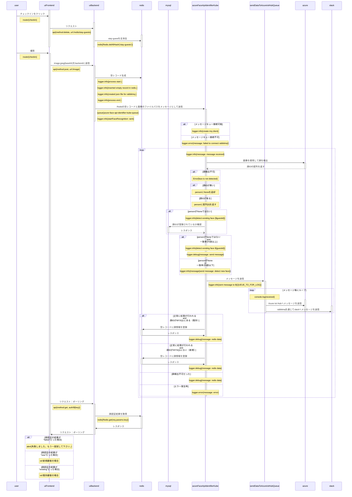

```mermaid

sequenceDiagram
# participant
participant user
participant uiFrontend
participant uiBackend
participant redis
participant mysql
participant azureFaceApiIdentifierKube
participant sendDataToAzureIotHubQueue
participant azure
participant slack


# チェックイン

activate uiFrontend
  user->>uiFrontend: チェックインをクリック
  Note right of user:router{checkin}
  activate uiBackend
    uiFrontend->>uiBackend: リクエスト
    Note right of uiFrontend:api{method:delete, url:/redis/stay-guests}
    activate redis
      uiBackend->>redis:stay-guestを全消去 
      Note right of uiBackend:redis{Redis.delAllHash('stay-guests')}
    deactivate redis
  deactivate uiBackend
deactivate uiFrontend

# 撮影

  activate uiFrontend
    user->>+uiFrontend: 撮影 
    Note right of user:router{checkin}
    
    activate uiBackend
      uiFrontend->>+uiBackend: image.jpeg(base64)をbackendに送信
      Note right of uiFrontend:api{method:post, url:/image}
      uiBackend->>redis:空レコード生成
      Note right of uiBackend:logger.info{process start.}
      Note right of uiBackend:logger.info{inserted empty record in redis.}
      Note right of uiBackend:logger.info{created json file for rabbitmq.}
      Note right of uiBackend:logger.info{process end.}
    activate azureFaceApiIdentifierKube
      uiBackend->>+azureFaceApiIdentifierKube: Redisの空レコードと画像のファイルパスをメッセージとして送信
      Note right of uiBackend: queue{azure-face-api-identifier-kube-queue}
      Note right of uiBackend: logger.info{startFaceRecognition: sent}
    deactivate uiBackend
    


    alt メッセージキュー接続可能
      Note over azureFaceApiIdentifierKube:logger.info{create mq client}
    else メッセージキュー接続不可
      Note over azureFaceApiIdentifierKube: logger.error{message: failed to connect rabbitmq!}
    end

    loop 
      Note over azureFaceApiIdentifierKube: logger.info{message: message received}
      azureFaceApiIdentifierKube->>+azure: 画像を使用して顔を検出
        azure--)-azureFaceApiIdentifierKube: 顔IDの配列を返す
      
        alt 顔検出不可
          Note over azureFaceApiIdentifierKube: Error{face is not detected}
        end

        alt 顔IDが無い
          Note over azureFaceApiIdentifierKube: personにNoneを返却
        else 顔IDが有る
          Note over azureFaceApiIdentifierKube: personに配列[0]を返す
        end

        alt personがNoneではない
          Note over azureFaceApiIdentifierKube: logger.info{detect existing face {$guestid}}
          azureFaceApiIdentifierKube->>+mysql : 顔IDが登録されているか確認
          mysql--)-azureFaceApiIdentifierKube : レスポンス
        end

        alt personがNoneではない<br>and<br>一致率が6割以上
          Note over azureFaceApiIdentifierKube:logger.info{detect existing face ${guestid}}
          Note over azureFaceApiIdentifierKube:logger.debug{message: send message}
        else personがNone<br>or<br>一致率が6割以下
          Note over azureFaceApiIdentifierKube:logger.info{message{send message: detect new face}}
        end

        
        activate sendDataToAzureIotHubQueue
          azureFaceApiIdentifierKube->>+sendDataToAzureIotHubQueue:メッセージを送信
          Note right of azureFaceApiIdentifierKube:logger.info{sent message to ${QUEUE_TO_FOR_LOG}}

          loop メッセージ毎にループ
            Note over sendDataToAzureIotHubQueue:console.log{received}
            activate azure
              sendDataToAzureIotHubQueue->>azure:Azure Iot Hubへメッセージを送信
              activate slack
                sendDataToAzureIotHubQueue->>slack:rabbitmqを通じてslackへメッセージを送信
              deactivate slack
            deactivate azure
          end
        deactivate sendDataToAzureIotHubQueue
        
        alt 正常に処理が行われる<br>and<br>顔IDがMYSQLにある（既存）
          azureFaceApiIdentifierKube->>+redis : 空レコードに顔情報を登録
          redis->>-azureFaceApiIdentifierKube : レスポンス
          Note over azureFaceApiIdentifierKube:logger.debug{message: redis data}
          
        else 正常に処理が行われる<br>and<br>顔IDがMYSQLにない（新規）
          azureFaceApiIdentifierKube->>+redis : 空レコードに顔情報を登録
          redis->>-azureFaceApiIdentifierKube : レスポンス
          Note over azureFaceApiIdentifierKube:logger.debug{message: redis data}

        else 顔検出不可だった
          Note over azureFaceApiIdentifierKube:logger.debug{message: redis data}
        
        else エラー発生時
          Note over azureFaceApiIdentifierKube:logger.error(message: error)
        end
      deactivate azureFaceApiIdentifierKube
    
    end

    uiFrontend->>+uiBackend: リクエスト：ポーリング
    Note right of uiFrontend:api{method:get, auth/${key}}
    uiBackend->>+redis: 顔認証結果を取得
    Note right of uiBackend:redis{Redis.get(req.params.key)}
    redis->>-uiBackend: レスポンス
    uiBackend->>-uiFrontend: リクエスト：ポーリング

  deactivate uiFrontend

  alt 顔認証の結果が<br>"failed"だった場合
    Note over uiFrontend:alert{失敗しました。もう一度試して下さい。}
  else 顔認証の結果が<br>"new"だった場合
    Note over uiFrontend:ref:新規顧客の場合
  else 顔認証の結果が<br>"existing"だった場合
    Note over uiFrontend:ref:既存顧客の場合
  end

```