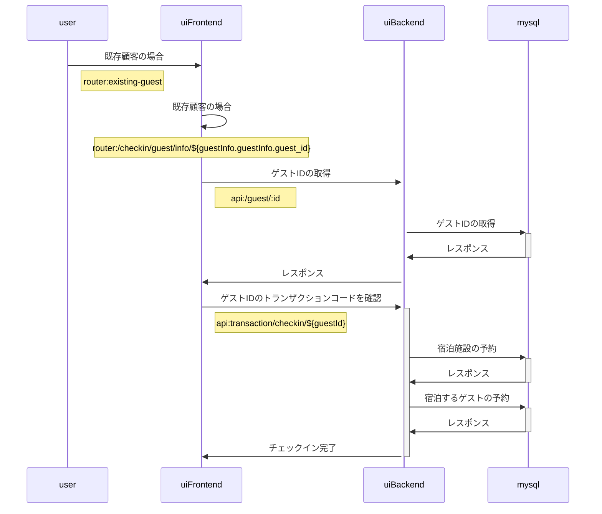

```mermaid

sequenceDiagram
# participant
participant user
participant uiFrontend
participant uiBackend
participant mysql


# 既存顧客の場合
  user->>uiFrontend: 既存顧客の場合
    Note right of user: router:existing-guest
  uiFrontend->>uiFrontend: 既存顧客の場合
    Note over uiFrontend: router:/checkin/guest/info/${guestInfo.guestInfo.guest_id}

  uiFrontend->>+uiBackend: ゲストIDの取得
    Note right of uiFrontend: api:/guest/:id
  uiBackend->>+mysql: ゲストIDの取得
  mysql->>-uiBackend: レスポンス
  uiBackend->>uiFrontend: レスポンス

  uiFrontend->>+uiBackend: ゲストIDのトランザクションコードを確認
    Note right of uiFrontend: api:transaction/checkin/${guestId}


  uiBackend->>+mysql: 宿泊施設の予約
  mysql->>-uiBackend: レスポンス

  uiBackend->>+mysql: 宿泊するゲストの予約
  mysql->>-uiBackend: レスポンス

  uiBackend->>-uiFrontend: チェックイン完了

```