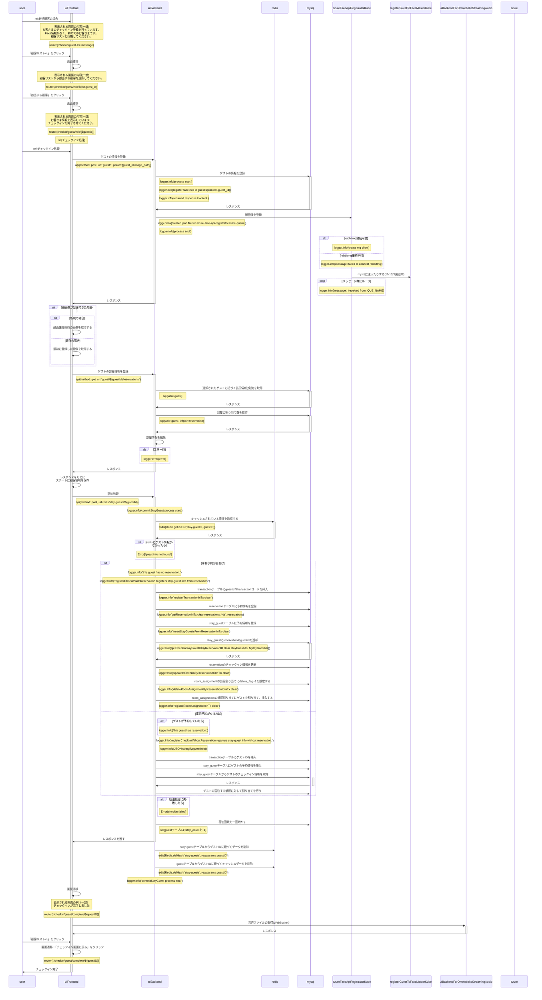

```mermaid

sequenceDiagram
# participant
participant user
participant uiFrontend
participant uiBackend
participant redis
participant mysql
participant azureFaceApiRegistratorKube
participant registerGuestToFaceMasterKube
participant uiBackendForOmotebakoStreamingAudio
participant azure


# 新規顧客の場合

  activate uiFrontend

  user->>uiFrontend: ref:新規顧客の場合
    Note over uiFrontend:表示される画面の内容(一部)<br>お客さまのチェックイン登録を行っています。<br>Face情報がなく、初めてのお客さまです。<br>顧客リストと同期してください。
    Note over uiFrontend:router{/checkin/guest-list-message}
  user->>uiFrontend: 「顧客リストへ」をクリック
  uiFrontend->>uiFrontend: 画面遷移
    Note over uiFrontend:表示される画面の内容(一部)<br>顧客リストから該当する顧客を選択してください。
    Note over uiFrontend:router{/checkin/guest/info/${list.guest_id}
  user->>uiFrontend: 「該当する顧客」をクリック
  uiFrontend->>uiFrontend: 画面遷移
    Note over uiFrontend:表示される画面の内容(一部)<br>お客さま情報を表示しています、<br>チェックインを完了させてください。
    Note over uiFrontend:router{checkin/guest/info/{$guestid}}
    Note over uiFrontend:ref{チェックイン処理}


# チェックイン処理
  user->>uiFrontend: ref:チェックイン処理
  uiFrontend->>+uiBackend: ゲストの情報を登録  
  Note right of uiFrontend:api{method: post, url:`guest/`, param:{guest_id,image_path}}

  uiBackend->>+mysql: ゲストの情報を登録
  Note right of uiBackend:logger.info{process start.}
  Note right of uiBackend:logger.info{register face info in guest ${content.guest_id}}
  Note right of uiBackend:logger.info{returned response to client.}
  mysql->>-uiBackend: レスポンス

  uiBackend->>azureFaceApiRegistratorKube: 顔画像を登録
  Note right of uiBackend:logger.info{created json file for azure-face-api-registrator-kube-queue.}
  Note right of uiBackend:logger.info{process end.}

  alt　rabbitmq接続可能
    Note over azureFaceApiRegistratorKube:logger.info{create mq client}
  else rabbitmq接続不可
    Note over azureFaceApiRegistratorKube:logger.info{message: failed to connect rabbitmq!}
  end

  azureFaceApiRegistratorKube->>registerGuestToFaceMasterKube: mysqlに送ったりする(11/13作業途中)

  loop メッセージ毎にループ
    Note over azureFaceApiRegistratorKube:logger.info{'message': 'received from: QUE_NAME}
  end
  uiBackend->>-uiFrontend: レスポンス

  alt 顔画像が登録できた場合
    alt 新規の場合
      uiFrontend->>uiFrontend: 顔画像撮影時の画像を取得する
    else 既存の場合
      uiFrontend->>uiFrontend: 最初に登録した画像を取得する
    end
  end

  uiFrontend->>+uiBackend: ゲストの部屋情報を登録  
  Note right of uiFrontend:api{method: get, url:`guest/${guestId}/reservations`}

  uiBackend->>+mysql: 選択されたゲストに紐づく部屋情報(複数)を取得
  Note right of uiBackend:sql{table:guest}
  mysql->>-uiBackend: レスポンス

  uiBackend->>+mysql: 部屋の割り当て数を取得
  Note right of uiBackend:sql{table:guest, leftjoin:reservation}
  mysql->>-uiBackend: レスポンス

  uiBackend->>uiBackend: 部屋情報を編集

  alt エラー時
    Note over uiBackend:logger.error{error}
  end
  
  uiBackend->>-uiFrontend: レスポンス

  uiFrontend->>uiFrontend: レスポンスをもとに<br>ステートに顧客情報を保存

  uiFrontend->>+uiBackend: 宿泊処理
  Note right of uiFrontend:api{method: post, url:redis/stay-guests/${guestId}}

  Note over uiBackend:logger.info(commitStayGuest process start.);
  uiBackend->>+redis: キャッシュされている情報を取得する
  Note right of uiBackend:redis{Redis.getJSON('stay-guests', guestID)}
  redis->>-uiBackend: レスポンス

  alt redisにゲスト情報がなかったら
    Note over uiBackend:Error{'guest info not found'}
  end

  alt 事前予約があれば
    Note over uiBackend:logger.Info('this guest has no reservation.')
    Note over uiBackend:logger.Info('registerCheckinWithReservation registers stay-guest info from reservation.')
    uiBackend->>mysql: transactionテーブルにguestidやtransactionコードを挿入
    Note right of uiBackend:logger.Info('registerTransactionInTx clear.')
    uiBackend->>mysql: reservationテーブルに予約情報を登録
    Note right of uiBackend:logger.Info('getReservationInTx clear reservations: %s', reservations)
    uiBackend->>mysql: stay_guestテーブルに予約情報を登録
    Note right of uiBackend:logger.Info('insertStayGuestsFromReservationInTx clear')
    uiBackend->>+mysql: stay_guestとreservationのguestidを返却
    Note right of uiBackend:logger.Info('getCheckinStayGuestIDByReservationID clear stayGuestIds: ${stayGuestIds})
    mysql->>-uiBackend: レスポンス

    uiBackend->>+mysql: reservationのチェックイン情報を更新
    Note right of uiBackend:logger.Info('updateIsCheckinByReservationIDInTX clear')

    uiBackend->>+mysql: room_assignmentの部屋割り当てにdelete_flag=1を設定する
    Note right of uiBackend:logger.Info('deleteRoomAssignmentByReservationIDInTx clear')

    uiBackend->>+mysql: room_assignmentの部屋割り当てにゲストを割り当て、挿入する
    Note right of uiBackend:logger.Info('registerRoomAssignmentInTx clear')
  else 事前予約がなければ
    alt ゲストが予約していたら
      Note right of uiBackend:logger.Info('this guest has reservation.');
    end

    Note right of uiBackend:logger.Info('registerCheckinWithoutReservation registers stay-guest info without reservation.')
    Note right of uiBackend:logger.Info(JSON.stringify(guestInfo));
    uiBackend->>mysql: transactionテーブルにゲストIDを挿入
    uiBackend->>mysql: stay_guestテーブルにゲストの予約情報を挿入
    uiBackend->>+mysql: stay_guestテーブルからゲストのチェックイン情報を取得
    mysql->>-uiBackend: レスポンス

    uiBackend->>+mysql: ゲストの宿泊する部屋に対して割り当てを行う

  end
  
    alt 宿泊処理に失敗したら
      Note right of uiBackend:Error{checkin failed}
    end

    uiBackend->>+mysql: 宿泊回数を一回増やす
    Note right of uiBackend:sql{guestテーブルのstay_countを+1}

  uiBackend->>-uiFrontend: レスポンスを返す
  uiBackend->>redis:stay-guestテーブルからゲストIDに紐づくデータを削除
  Note right of uiBackend:redis{Redis.delHash('stay-guests', req.params.guestID)}

  uiBackend->>redis:guestテーブルからゲストIDに紐づくキャッシュデータを削除
  Note right of uiBackend:redis{Redis.delHash('stay-guests', req.params.guestID)}

  Note over uiBackend:logger.Info('commitStayGuest process end.');  

  uiFrontend->>uiFrontend: 画面遷移
  Note over uiFrontend:表示される画面の例（一部）<br>チェックインが完了しました
  Note over uiFrontend:router{`/checkin/guest/complete/${guestID}};  

  uiFrontend->>+uiBackendForOmotebakoStreamingAudio: 音声ファイルの取得(WebSocket)
  uiBackendForOmotebakoStreamingAudio->>-uiFrontend: レスポンス
  user->>uiFrontend: 「顧客リストへ」をクリック

  uiFrontend->>uiFrontend: 画面遷移：「チェックイン画面に戻る」をクリック
  Note over uiFrontend:router{`/checkin/guest/complete/${guestID}};  
  uiFrontend->>user:チェックイン完了

  deactivate uiFrontend
```